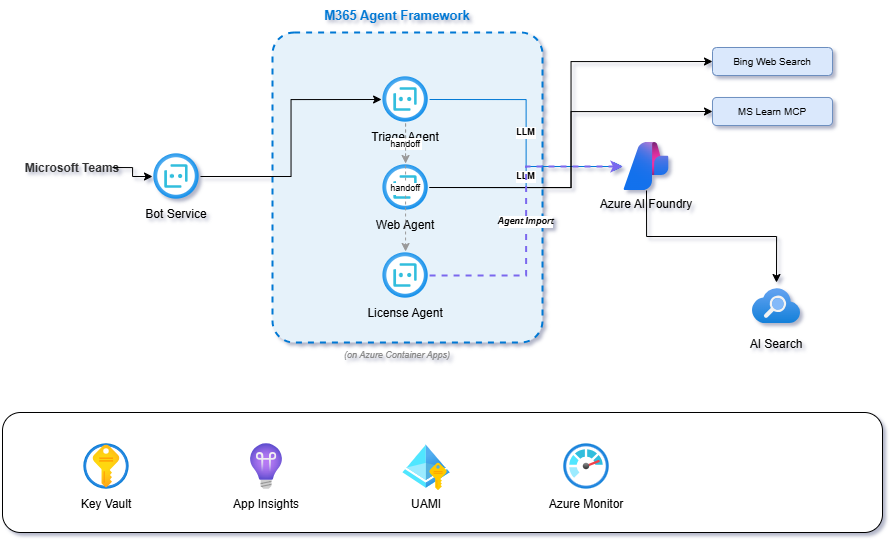
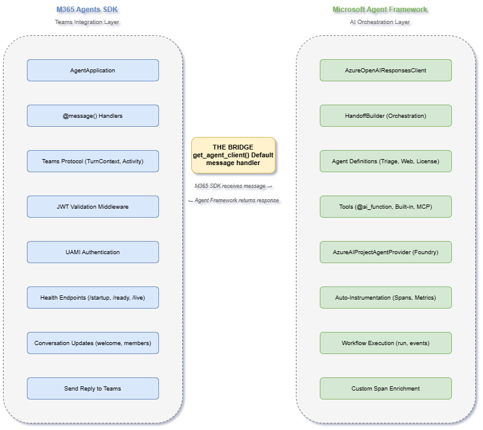

# Talk Track: Building Multi-Agent Bots with M365 Agents SDK + Microsoft Agent Framework

> **Duration**: 60 minutes | **Format**: Hybrid (problem → surgical code snippet → move on) | **One live demo moment**
>
> **Narrative thread**: *"Here's how to build production multi-agent bots in Teams — and it's easier than you think."*

---

## Section 1: Why Multi-Agent? `[0:00–5:00]`


### Talk Track

- "Everyone's building AI bots. Most start with one agent, one prompt, all the tools. It works for demos. It fails in production."
- "What if your licensing expert needs a knowledge base but your general assistant needs web search? Different tools, different instructions, different evaluation criteria."
- "A single monolithic agent buckles — bloated system prompts, conflicting tools, can't evaluate specific capabilities."
- "The answer is multi-agent orchestration — a triage agent classifies intent, specialist agents handle domains."
- "Today I'll show you exactly how to build this with two frameworks that work together: **M365 Agents SDK** for Teams integration, and **Microsoft Agent Framework** for the AI orchestration."

> **Key takeaway**: Multi-agent is about domain decomposition, independent evaluation, and focused tools — not complexity for its own sake.

---

## Section 2: The Two Frameworks — Where Each Plays `[5:00–13:00]`



### Talk Track — M365 Agents SDK (what it owns)

- "M365 Agents SDK is your Teams plumbing. It handles message delivery, authentication, activity processing, Teams protocol."

**Code snippet** → [`src/app/__main__.py`](../src/app/__main__.py) — the `AgentApplication` constructor:

```python
auth_config = AgentAuthConfiguration(
    connection_manager=connection_manager,
    auth_type=AuthTypes.UserAssignedMsi,
)

AGENT_APP = AgentApplication(
    auth_config=auth_config,
    adapter=CloudAdapter(auth_config),
    storage=MemoryStorage(),
)
```

- "That's it. UAMI auth, cloud adapter, memory storage — three lines and your bot is talking to Teams."
- "Decorator-based handlers — `@AGENT_APP.message(regex)` for commands, `@AGENT_APP.conversation_update()` for lifecycle events."
- "Health endpoints, JWT validation, Teams ↔ Bot channel routing — all built in."

### Talk Track — Microsoft Agent Framework (what it owns)

- "Agent Framework is the AI brain. It creates agents, manages tools, orchestrates handoffs between agents, and auto-instruments everything for observability."

**Code snippet** → [`src/app/__main__.py`](../src/app/__main__.py) — the bridge point (default message handler):

```python
agent = get_agent_client()
response = await agent.chat(
    message=user_message,
    conversation_id=conversation_id,
    user_name=user_context.user_name,
)
```

- "This is **the bridge**. M365 SDK receives the Teams message. One function call later, Agent Framework takes over."

### Framework Boundary Table

| Responsibility | M365 Agents SDK | MS Agent Framework |
|---|---|---|
| Receives Teams message | ✓ | |
| JWT / UAMI auth | ✓ | |
| Message handlers (`@message`) | ✓ | |
| Agent creation (`as_agent()`) | | ✓ |
| Tool execution | | ✓ |
| Handoff routing | | ✓ |
| Auto-instrumentation | | ✓ |
| LLM calls | | ✓ |
| Sends response to Teams | ✓ | |

> **Key takeaway**: M365 SDK is the message bus; Agent Framework is the intelligence. They compose at one clean bridge point: `get_agent_client()`.

---

## Section 3: Auth & Identity — UAMI in Action `[13:00–21:00]`


### Talk Track

- "Traditional bots used `MICROSOFT_APP_PASSWORD`. UAMI eliminates that entirely."

**Code snippet** → `env.TEMPLATE` key variables:

```bash
AZURE_CLIENT_ID=<uami-client-id>     # This IS the bot identity
AZURE_TENANT_ID=<home-tenant>
MICROSOFT_APP_ID=<same as AZURE_CLIENT_ID>  # Yes, same value!
```

- "UAMI is a managed identity assigned to your Container App. It authenticates to Bot Service, to Key Vault, to Azure OpenAI — all without a single password in your code or environment."

**Code snippet** → [`src/app/agents/foundry_agent_client.py`](../src/app/agents/foundry_agent_client.py) — credential selection:

```python
def _get_credential(self):
    local_debug = os.getenv("LOCAL_DEBUG", "").lower() in ("true", "1", "yes")

    if local_debug:
        return AzureCliCredential()           # Your az login session
    elif self.managed_identity_client_id:
        return ManagedIdentityCredential(     # UAMI in production
            client_id=self.managed_identity_client_id
        )
    else:
        return DefaultAzureCredential()
```

- "Two paths. Local dev uses `az login`. Production uses UAMI. No if/else for secrets anywhere."

> **Key takeaway**: UAMI means zero secrets in code, zero secrets in environment variables. The container has an identity, not a password.

---

## Section 4: Multi-Agent Architecture `[21:00–33:00]`

 — zoom into HandoffBuilder section

### Agent Definitions — Three Tool Types in One System

**Triage Agent** — routing only, no tools:

**Code snippet** → [`src/app/agents/triage_agent.py`](../src/app/agents/triage_agent.py):

```python
def create_triage_agent(client: AzureOpenAIResponsesClient) -> Agent:
    return client.as_agent(
        name="triage",
        instructions=TRIAGE_INSTRUCTIONS,
        description="Routes Microsoft questions to the appropriate specialist agent",
    )
```

- "This agent's only job is to decide: web question or licensing question? No tools, just instructions."

**Web Agent** — three tool types in ~8 lines:

**Code snippet** → [`src/app/agents/web_agent.py`](../src/app/agents/web_agent.py):

```python
tools = [
    decode_microsoft_acronym,                              # @ai_function (local Python)
    AzureOpenAIResponsesClient.get_web_search_tool(),      # Built-in (Bing-backed)
    MCPStreamableHTTPTool(                                 # MCP (Microsoft Learn)
        name="microsoft_learn",
        url="https://learn.microsoft.com/api/mcp",
        description="Official Microsoft Learn MCP Server",
    ),
]
```

- "Three completely different tool types — a local function, a platform built-in, and an external MCP server — all in 8 lines."

**License Agent** — Foundry-deployed:

**Code snippet** → [`src/app/agents/license_agent.py`](../src/app/agents/license_agent.py):

```python
provider = AzureAIProjectAgentProvider(
    project_endpoint=endpoint, credential=async_credential
)
agent = await provider.get_agent(name="unified-knowledge-agent-1")
```

- "This retrieves an existing agent from Azure AI Foundry. It has its own knowledge base, its own instructions. We don't recreate it — we reuse it."

### Orchestration — HandoffBuilder

**Code snippet** → [`src/app/agents/orchestrator.py`](../src/app/agents/orchestrator.py):

```python
builder = (
    HandoffBuilder(
        name="ms-expert-orchestration",
        participants=participants,
        termination_condition=_max_handoffs_termination(6),
    )
    .with_start_agent(triage)
    .add_handoff(triage, triage_targets)
)
workflow = builder.build()
```

- "Five lines. Triage starts. It can hand off to web or license. Specialists never hand back — one-way routing prevents loops. Six handoffs max as a safety net."
- "Why one-way? Autonomous mode with Foundry agents caused infinite 'Continue assisting' loops. One-way is simpler and reliable."

### Fresh Workflow Pattern

**Code snippet** → [`src/app/agents/foundry_agent_client.py`](../src/app/agents/foundry_agent_client.py):

```python
await self._ensure_agents_created()  # Agents created ONCE (expensive)
workflow = self._create_workflow()    # Fresh workflow per message (cheap)
result = await workflow.run(chat_messages)
```

- "Agents are expensive to create — HTTP calls to Foundry. Workflows are cheap but stateful. Create agents once, fresh workflow per message."
- "If you reuse a workflow across messages, you get stale 'No tool output found' errors. This was a hard-won lesson."

> **Key takeaway**: Define agents with focused tools, wire them with `HandoffBuilder` in 5 lines, use fresh-workflow pattern to avoid stale state.

---

## Section 5: Observability & Monitoring `[33:00–43:00]`

### Talk Track — Dual-Mode Telemetry

**Code snippet** → [`src/app/trace_config.py`](../src/app/trace_config.py):

```python
if local_tracing:
    configure_otel_providers(vs_code_extension_port=4317)  # AI Toolkit
else:
    configure_azure_monitor(
        connection_string=connection_string,
        resource=create_resource(),
    )
    enable_instrumentation(enable_sensitive_data=False)
```

- "One function. Local sends to AI Toolkit in VS Code (port 4317). Production sends to App Insights. Same instrumentation, two destinations."
- "**Critical order**: `configure_azure_monitor()` MUST come before `enable_instrumentation()`. Otherwise Agent Framework creates spans with nowhere to go."

### What You Get for Free (Agent Framework auto-instrumentation)

- "Agent Framework auto-instruments with zero code: `invoke_agent triage`, `chat gpt-4.1`, `execute_tool web_search` — all as nested spans."
- "Auto metrics: token usage per model, LLM call duration, tool execution latency."
- *(Point to the [framework-responsibilities.drawio](framework-responsibilities.drawio) — "Auto-Instrumentation" in the Agent Framework column)*

### Custom Span Enrichment

**Code snippet** → [`src/app/agents/foundry_agent_client.py`](../src/app/agents/foundry_agent_client.py):

```python
with tracer.start_as_current_span("Teams Bot Agent Chat", kind=SpanKind.CLIENT) as span:
    span.set_attribute("agent.route", route_label)          # "triage → web_agent"
    span.set_attribute("agent.handoff_count", len(handoff_chain))
    span.add_event("handoff", {"from": source, "to": target})
    span.update_name(f"Agent Chat [{route_label}]")
```

- "Agent Framework gives you the spans. You add the business context — which route was taken, how many handoffs, which conversation."

### 🎬 LIVE DEMO MOMENT (~3 min)

1. Send a message in Teams
2. Switch to AI Toolkit / App Insights
3. Show the trace waterfall: user message → triage → web_agent → LLM call → tool executions
4. *"Every decision the system made, visible in one trace."*

### Dashboards

- Show [`docs/KQL_CHEATSHEET.md`](KQL_CHEATSHEET.md): agent routing summary query, token usage by model
- Show Azure Workbook (`scripts/workbook-template.json`): 7 tabs — Health, Agent Routing, Token Usage, Tool Performance, Errors, Conversation Drilldown, Slow Requests

> **Key takeaway**: Observability is nearly free. Agent Framework auto-instruments the AI layer. You add business context. One trace tells the whole story.

---

## Section 6: Evaluation `[43:00–48:00]`

[`src/app/eval/multi_agent_eval.py`](../src/app/eval/multi_agent_eval.py)

### Talk Track

**Code snippet** — Custom evaluators for multi-agent:

```python
RoutingAccuracyEvaluator    # Does triage route to the correct specialist?
HandoffEfficiencyEvaluator  # Clean chains? No loops?
CrossAgentContextEvaluator  # Context preserved across agent switches?
```

- "Custom evaluators for multi-agent: routing accuracy (1.0 = correct agent, 0.0 = wrong), handoff efficiency (penalizes loops), context retention."
- "Plus Foundry built-in evaluators: coherence, fluency, relevance, task completion."
- "Test data covers four categories: `microsoft_in_scope`, `licensing`, `out_of_scope`, `greeting`."
- "Run locally or log to Foundry portal for cloud-based evaluation. This becomes your quality gate before deployment."

> **Key takeaway**: Evaluate routing, not just responses. Multi-agent needs multi-agent metrics.

---

## Section 7: Deployment & Cross-Tenancy `[48:00–58:00]`

**Show on screen**: [cross-tenant-auth.drawio](cross-tenant-auth.drawio)

### Deployment with UAMI

**Code snippet** → [`scripts/deploy-bot.ps1`](../scripts/deploy-bot.ps1) — key steps:

- ACR build (no local Docker needed)
- Container App creation with `--user-assigned` UAMI
- `--registry-identity` for ACR pull (UAMI again, no ACR passwords)
- Environment variables synced from `.env`, forced `LOCAL_DEBUG=false`

*"UAMI does everything: authenticates to Bot Service, pulls from ACR, accesses Key Vault, calls Azure OpenAI. One identity, zero secrets."*

### Cross-Tenancy: "And One More Thing"

Walk the audience through [cross-tenant-auth.drawio](cross-tenant-auth.drawio) step by step:

1. **"Your bot lives in Tenant A (Contoso). Your users are in Tenant B (Fabrikam)."**

2. **"UAMI stays in Tenant A."** It authenticates the bot to Bot Service. It never crosses the tenant boundary.

3. **"Multi-tenant App Registration"** — this is a SEPARATE identity. You register it as multi-tenant in Tenant A.

4. **"When Tenant B's admin consents, a Service Principal is auto-created in Tenant B."** This is how your app exists in their tenant.

5. **"Teams admin in Tenant B installs the bot app → RSC permissions granted per-team at install."** No tenant-wide admin consent required.

### UAMI vs App Registration (the distinction that confused us)

- "This was our biggest confusion. Let me be explicit:"

| Identity | Purpose | Scope |
|---|---|---|
| **UAMI** | Bot identity → Bot Service, Key Vault, Azure OpenAI | Home tenant only. No secrets. |
| **Multi-tenant App Reg** | Graph API identity → client credentials to target tenant | Cross-tenant. Secret in Key Vault. |

- "They are **completely separate identities** for **completely separate purposes**."
- "`AZURE_CLIENT_ID` = UAMI Client ID = `MICROSOFT_APP_ID` — same value, different conceptual roles. This naming overlap caused us hours of debugging."

### Graph API with RSC

**Code snippet** → [`src/app/graph_rsc_client.py`](../src/app/graph_rsc_client.py):

```python
# Architecture:
# 1. UAMI authenticates to Azure Key Vault (no secrets in code/config)
# 2. Client secret retrieved from Key Vault
# 3. Client credentials flow to TARGET tenant's Graph API
# 4. RSC permissions (granted at app install) allow channel message access
```

- "The bot uses UAMI to get the secret, then uses the secret for client credentials flow to the OTHER tenant. Two hops, two identities."
- "RSC requires the `/beta` Graph endpoint. Adding Graph API permissions in Azure AD overwrites RSC consent. We learned this the hard way."

> **Key takeaway**: UAMI ≠ App Registration. UAMI is your bot's local identity. App Registration is how you reach across tenants. Don't conflate them.

---

## Section 8: Learnings & Close `[58:00–60:00]`

### Rapid-Fire Top Learnings

1. **Fresh workflow, cached agents** — or you get stale `No tool output found` errors
2. **Instrumentation order** — `configure_azure_monitor()` before `enable_instrumentation()`, and set `AZURE_EXPERIMENTAL_ENABLE_GENAI_TRACING=true`
3. **Teams ID formats** — Graph needs GUIDs, not `19:xxx` thread IDs. We built `TeamMappingCache` to solve it.
4. **RSC gotcha** — `/beta` endpoint only. Graph API permissions overwrite RSC. Remove all AAD app permissions except `User.Read`.

### Closing

*"Two frameworks, three agents, zero secrets, full observability. The hard parts were auth and identity, not the AI. Everything you saw is open — go build yours."*

---

## Quick Reference: Files to Prepare

| Section | File | What to show |
|---------|------|-------------|
| 2 | `src/app/__main__.py` | `AgentApplication` constructor, default handler bridge |
| 3 | `env.TEMPLATE` | UAMI env vars |
| 3 | `src/app/agents/foundry_agent_client.py` | Credential selection |
| 4 | `src/app/agents/triage_agent.py` | Routing-only agent |
| 4 | `src/app/agents/web_agent.py` | 3 tool types |
| 4 | `src/app/agents/license_agent.py` | Foundry agent retrieval |
| 4 | `src/app/agents/orchestrator.py` | HandoffBuilder (5 lines) |
| 4 | `src/app/agents/foundry_agent_client.py` | Fresh workflow pattern |
| 5 | `src/app/trace_config.py` | Dual-mode telemetry |
| 5 | `src/app/agents/foundry_agent_client.py` | Custom span enrichment |
| 5 | `docs/KQL_CHEATSHEET.md` | KQL queries for dashboards |
| 6 | `src/app/eval/multi_agent_eval.py` | Custom evaluators |
| 7 | `scripts/deploy-bot.ps1` | UAMI deployment |
| 7 | `src/app/graph_rsc_client.py` | Cross-tenant Graph API |

## Diagrams

| Diagram | File | Shown in |
|---------|------|----------|
| System Architecture | [architecture-overview.drawio](architecture-overview.drawio) | Section 1, 4 |
| Framework Responsibilities | [framework-responsibilities.drawio](framework-responsibilities.drawio) | Section 2, 5 |
| Sequence Flow | [sequence-flow.drawio](sequence-flow.drawio) | *(optional deep-dive)* |
| Cross-Tenant Auth | [cross-tenant-auth.drawio](cross-tenant-auth.drawio) | Section 7 |
